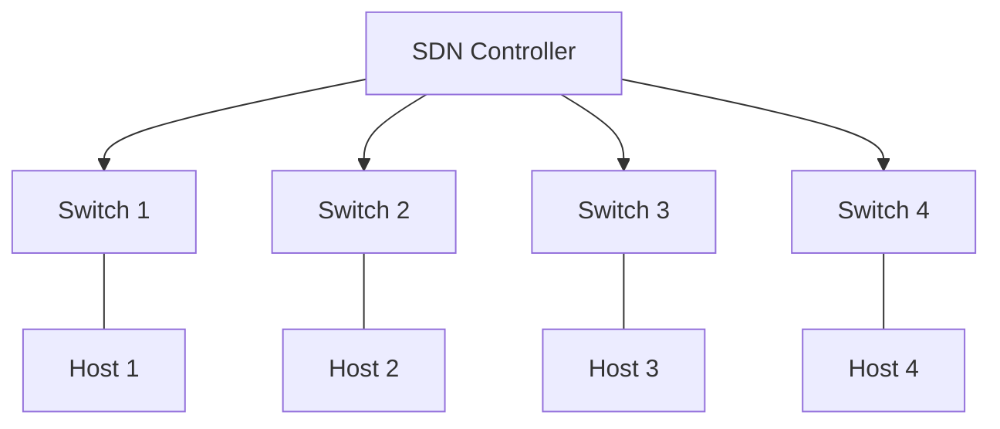

# BÁO CÁO THỰC HÀNH

## Môn học: Công nghệ mạng khả lập trình

**Buổi báo cáo:** Lab 01  
**Tên chủ đề:** Cài đặt Ryu Controller, Mininet và thiết kế mô hình SDN đơn giản  
**GVHD:** Phan Xuân Thiện  
**Ngày thực hiện:** 09/03/2025  

## THÔNG TIN CHUNG

- **LỚP:** NT541.P12

| STT | Họ và tên | MSSV | Email |
|-----|-----------|------|-------|
| 1 | Đinh Huỳnh Gia Bảo | 22520101 | 22520101@gm.uit.edu.vn |

## ĐÁNH GIÁ KHÁC

| Thông tin | Chi tiết |
|-----------|----------|
| Tổng thời gian thực hiện | 09/03/2025 – 10/03/2025 |
| Link Video thực hiện | [Video báo cáo](https://drive.google.com/file/d/1p7XKqg5l9u4JMViHw5TRKrRE_RId-9hq/view?usp=sharing) |

---

# BÁO CÁO CHI TIẾT

Sơ đồ mạng 


## Câu 1: Cài đặt SDN/OpenFlow controller (remote controller) - Dùng Ryu controller

### Bước 1: Cập nhật các gói trước khi bắt đầu
```bash
sudo apt update
```

### Bước 2: Cài đặt các gói phụ thuộc cần thiết
```bash
sudo apt install -y python3-pip python3-dev git
```
- `python3-pip`: Công cụ quản lý package của Python.
- `python3-dev`: Công cụ phát triển cho Python.
- `git`: Công cụ quản lý mã nguồn.

### Bước 3: Cài đặt Ryu Controller thông qua pip
```bash
sudo pip3 install ryu
```

## Câu 2: Tạo mạng OpenFlow bằng Mininet, kết nối với Ryu controller

### Bước 1: Cài đặt Mininet
```bash
sudo apt install mininet
```

### Bước 2: Kiểm tra Mininet
```bash
mn --version
sudo mn --switch ovsbr --test pingall
```

### Bước 3: Tạo mạng OpenFlow bằng Mininet và kết nối với Ryu controller

#### Tạo thư mục cho Ryu Controller
```bash
mkdir -p ~/ryu_controller
cd ~/ryu_controller
nano simple_switch_13.py
```

#### Khởi động Ryu Controller
```bash
ryu-manager simple-switch_13.py --verbose --observe-links
```

Nếu gặp lỗi `ImportError: cannot import name 'ALREADY_HANDLED' from 'eventlet.wsgi'`, thực hiện:
```bash
pip install eventlet==0.30.2
```

#### Tạo topology trong Mininet
```bash
mkdir -p ~/mininet_custom
cd ~/mininet_custom
nano custom-topology.py
```

#### Khởi động Mininet với topology tùy chỉnh
```bash
sudo mn --custom ~/mininet_custom/custom-topology.py --topo=mytopo --mac --switch ovs,protocols=OpenFlow13 --controller=remote,ip=127.0.0.1,port=6653
```

## Câu 3: Dùng Wireshark tiến hành bắt các gói tin OpenFlow (v1.3)

### Bước 1: Cài đặt Wireshark
```bash
sudo apt install wireshark
```

### Bước 2: Khởi động Wireshark với tùy chọn interface loopback

### Bước 3: Tiến hành bắt các gói tin, áp dụng các bộ lọc:
```bash
openflow_v4.type==0  # OFP Hello
openflow_v4.type==5  # OFP Features Request
openflow_v4.type==6  # OFP Features Reply
openflow_v4.type==10 # OFP Packet In
openflow_v4.type==14 # OFP FlowMod
```

## Câu 4: Liệt kê, mô tả các trường thông tin chính trong mỗi loại thông điệp

### Gói tin OFP Hello
| Trường thông tin | Mô tả |
|-----------------|-------|
| **Version** | Phiên bản của OpenFlow: 0x04 cho OpenFlow 1.3 |
| **Type** | Loại gói tin: OFPT_HELLO |
| **Length** | Tổng kích thước của gói tin tính bằng byte |
| **Transaction ID** | ID của giao dịch để kiểm soát phản hồi từ switch |

### Gói tin OFP Features Request
| Trường thông tin | Mô tả |
|-----------------|-------|
| **Version** | Phiên bản của OpenFlow: 0x04 cho OpenFlow 1.3 |
| **Type** | Loại gói tin: OFPT_FEATURES_REQUEST |
| **Length** | Tổng kích thước của gói tin tính bằng byte |
| **Transaction ID** | ID của giao dịch để kiểm soát phản hồi từ switch |

### Gói tin OFP Features Reply
| Trường thông tin  | Mô tả |
|------------------|-------|
| **Version** | Phiên bản của OpenFlow: 0x04 cho OpenFlow 1.3 |
| **Type** | Loại gói tin: OFPT_FEATURES_REQUEST |
| **Length** | Tổng kích thước của gói tin tính bằng byte |
| **Transaction ID** | ID của giao dịch để kiểm soát phản hồi từ switch |
| **Datapath ID** | ID duy nhất của switch, được ánh xạ đến địa chỉ MAC của switch. |
| **n_buffers** | Số lượng buffer mà switch có thể lưu trữ tạm thời cho các gói tin chưa có rule xử lý. |
| **n_tables** | Số lượng bảng điều khiển (flow tables) mà switch hỗ trợ. |
| **auxiliary_id** | Định danh kết nối giữa switch và controller. Giá trị 0 chỉ ra rằng đây là kết nối chính. |
| **Pad** | Căn chỉnh byte nhằm đảm bảo dữ liệu trong gói tin có kích thước phù hợp khi truyền. |
| **Capabilities** | Chỉ ra các khả năng mà switch hỗ trợ. Giá trị 0x00000004 có nghĩa là switch hỗ trợ Flow Statistics. |
| **Reserved** | Dự phòng cho những mục trong tương lai và luôn có giá trị 0 để sử dụng trong phiên bản này. |

### Gói tin OFP Packet In
| Trường thông tin | Mô tả |
|------------------|-------|
| Buffer_id | ID của buffer trên switch |
| Total_len | Tổng độ dài gói tin |
| Reason | Lý do gửi |
| Table_id | ID của bảng flow |

### Gói tin OFP FlowMod
| Trường thông tin | Mô tả |
|------------------|-------|
| Command | Thực hiện thêm/sửa/xóa flow entry |
| Idle_timeout | Thời gian timeout |
| Priority | Độ ưu tiên của flow |

---

Báo cáo hoàn thành vào ngày 10/03/2025.
