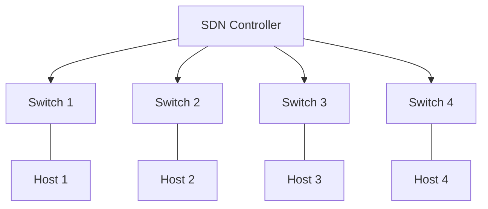

```mermaid
graph TD;
    Controller["SDN Controller"]
    
    S1["Switch 1"] --- H1["Host 1"]
    S2["Switch 2"] --- H2["Host 2"]
    S3["Switch 3"] --- H3["Host 3"]
    S4["Switch 4"] --- H4["Host 4"]

    Controller --> S1
    Controller --> S2
    Controller --> S3
    Controller --> S4
```